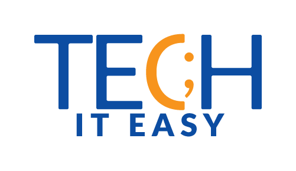
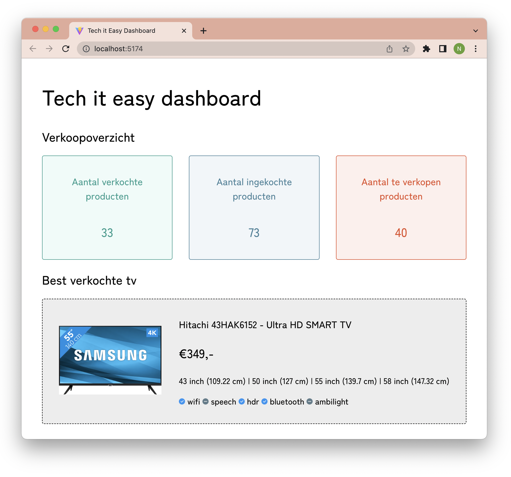

# Opdrachtbeschrijving

## Inleiding

Je bent net begonnen als developer bij een bedrijf genaamd _Tech It Easy_, dat TV's verkoopt. Recentelijk hebben ze Fred
van financieën ontslagen omdat hij telkens wel online was op Teams, maar eigenlijk dutjes deed en niets uitvoerde. Dit
betekent dat de medewerkers een financieel dashboard nodig hebben om zelf de administratie bij te houden.

Omdat Fred al heel lang niets heeft uitgevoerd is het niet zo goed gesteld met de financieën. Je kunt er daarom vanuit
gaan dat de voorraad met televisies op dit moment statisch is, maar in de toekomst dynamisch wordt.



In de `inventory` array (in `constants/inventory.js`) vind je 8 tv-objecten. Elk tv-object bevat de volgende informatie:

* `type` - het tv type
* `brand` - het merk
* `name` - de benaming
* `price` - de prijs (_in hele euro's_)
* `availableSizes` - een array met beschikbare schermgroottes voor dit model (_in inches_)
* `refreshRate` - de beeldverversing (_in Hz_)
* `screenType` - het type scherm (_LED - QLED - LCD_)
* `screenQuality` - de resolutie van het scherm (_Ultra HD/4K - Full HD - HD Ready_)
* `smartTv` - boolean waarde die aangeeft of het een Smart TV betreft
* `options` - een array met objecten waarin met booleans is aangegeven welke opties wel en niet aanwezig zijn (_Wifi,
  spraakbesturing, HDR, Bluetooth en AmiLight_)
* `originalStock` - de hoeveelheid exemplaren van dit type die tijdens deze voorraad-batch zijn ingekocht
* `sold` - de hoeveelheid verkochte exemplaren van dit type

## Deel 1

Door de opdrachten te maken bouw je langzaam het eerste deel van het Tech It Easy Dashboard op. Je bent vrij om de
styling van het voorbeeld over te nemen, of jouw eigen huisstijl te bedenken. Zorg er wel voor dat je eerst aan de slag
gaat met de technische opdrachten voor je jouw tijd besteed aan styling.



### Opdracht 1 - Helperfuncties

Je zult in deze opdracht meerdere helperfuncties gaan schrijven die we gaan gebruiken om de juiste informatie op
het dashboard weer te geven. Je gebruikt hier de data uit de `inventory`-array voor. Deze vind je in de `constants`-map.
_Tip:_ maak voor iedere helperfunctie een apart bestand en vergeet deze niet aan te roepen in `App.jsx`, anders blijft de console leeg!

* **Opdracht 1a:** Hoeveel tv's zijn er al verkocht? Schrijf een helperfunctie dat dit berekent. Log de uitkomst in de
  console.
* **Opdracht 1b:** Zorg ervoor dat dit aantal in het groen wordt weergegeven op de pagina.
* **Opdracht 1c:** Hoeveel tv's heeft Tech It Easy ingekocht? Schrijf een helperfunctie dat dit berekent. Log de
  uitkomst in de
  console.
* **Opdracht 1d:** Zorg ervoor dat dit aantal in het blauw wordt weergegeven op de pagina.
  @todo ja?
* **Opdracht 1e:** Schrijf een helperfunctie die berekent hoeveel tv's er nog verkocht moeten worden. Geef de uitkomst
  in het rood weer op de pagina.

### Opdracht 2 - Productweergave

Je gaat verschillende helperfuncties schrijven om de informatie over één tv op de juiste manier op de pagina weer te
geven. Gebruik het `bestSellingTv`-object als input, maar houdt er rekening mee dat we hier ieder gewenst tv-object
voor moeten kunnen gebruiken. We gaan deze tv weergeven in het volgende format:

```shell
Samsung UHD 55AU7040 - Crystal
€549,-
43 inch (109 cm) | 50 inch (127 cm) | 55 inch (140 cm) | 65 inch (165 cm)
```

* **Opdracht 2a:** Maak een helperfunctie die een string genereert voor de naam van één tv en deze teruggeeft in het
  format `[merk] [type] - [naam]` zoals _Philips 43PUS6504/12 - 4K TV_ of _NIKKEI NH3216SMART - HD smart TV_.

* **Opdracht 2b:** Maak een helperfunctie die de prijs van één tv als parameter verwacht (zoals 379 of 159) teruggeeft
  in het format €379,- of €159,-.

* **Opdracht 2c:** Maak een helperfunctie die een string genereert voor alle beschikbare schermgroottes van één tv. De
  functie geeft dit terug in het format:

```shell
[schermgrootte] inches ([schermgrootte omgerekend]cm) | [schermgrootte] inches ([schermgrootte omgerekend]cm) etc.
```

Als een tv maar één schermgrootte heeft (`[32]`) wordt de output `32 inch (81 cm)`. Wanneer een tv vier schermgroottes
heeft (`[43, 50, 55, 58]`) wordt de output `43 inch (109 cm) | 50 inch (127 cm) |
58 inch (147 cm)`. Rond altijd af op hele centimeters.

* **Opdracht 2d:** Gebruik jouw helperfuncties om de informatie van het `bestSellingTv`-object, inclusief afbeelding, op
  de pagina weer te geven.

* **Opdracht 2e:** gebruik de iconen uit de `assets`-map om, op basis van de informatie uit het `bestSellingTv`-object,
  weer te geven welke toepassingen aanwezig zijn op de tv. Doe dit voor nu nog even door de informatie zelf, handmatig
  uit te typen:

```shell
[check-icon] wifi [not-icon] speech [check-icon] hdr [check-icon] bluetooth [not-icon] ambilight
```

## Deel 2

### Opdracht 1

* **Opdracht 1a:** Gebruik een array-methode om een array te maken met alle tv-type namen. Log de uitkomst in de
  console.
* **Opdracht 1b:** Gebruik een array-methode om alle tv's te verzamelen (de hele objecten) die volledig uitverkocht
  zijn. Log de uitkomst in de console.
* **Opdracht 1c:** Gebruik een array-methode om alle tv's te verzamelen (de hele objecten) die over AmbiLight
  beschikken. Log de uitkomst in de console.
* **Opdracht 1d:** Schrijf een functie die alle tv's van laagste naar hoogste prijs sorteert. Log de uitkomst in de
  console.

**Opdracht 4e:** Maak een herbruikbare functie die de informatie van alle tv's weergeeft op de pagina. Gebruik hiervoor
de map-methode in combinatie met de functies die je hebt gemaakt in opdracht 4a, 4b en 4c.

* **Opdracht 3a:** Gebruik een array-methode om alle tv merken (zoals Philips, NIKKEI, etc.) in een lijst op de pagina
  weer te geven. Zorg ervoor dat dit ook zou werken als we 200 tv's in onze array zouden hebben staan. Dat er dubbele
  namen in zitten, is niet erg.
* **Opdracht 3b:** Schrijf de code uit 3a om naar een functie die een array met tv-objecten verwacht. Het is handig om
  onze scripts als functies op te zetten, zodat we ze gemakkelijk kunnen hergebruiken. Tip: vergeet deze functie
  -declaratie niet aan te roepen!

* **Opdracht 4e:** Gebruik een ternary-operator om alle opties weer te geven met een - of check.
* **Opdracht 4e:** Wanneer een tv uitverkocht is, willen we een 'sold-out' afbeelding bij de tv weergeven. Bedenk zelf
  hoe je dit het best kunt aanpakken.

Maak drie knoppen op de pagina: Sorteer op prijs, AmbiLight TV's en Uitverkochte exemplaren. Gebruik de code die je in
opdracht 1b, 1c en 1d hebt gemaakt en schrijf dit om naar functies zodat je ze kunt aanroepen op het moment dat de
buttons geklikt worden. Zorg ervoor dat de functies de uitkomsten in de de console loggen als de gebruiker op de
bijbehorende knop klikt. Tip: lees hiervoor paragraaf 7.4 op EdHub eens door! Zorg er nu voor, in plaats van dat de
uitkomsten in de console worden gelogd, dat de uitkomsten worden meegegeven aan jouw functie uit 4e zodat de resultaten
daadwerkelijk op de pagina weergegeven worden!